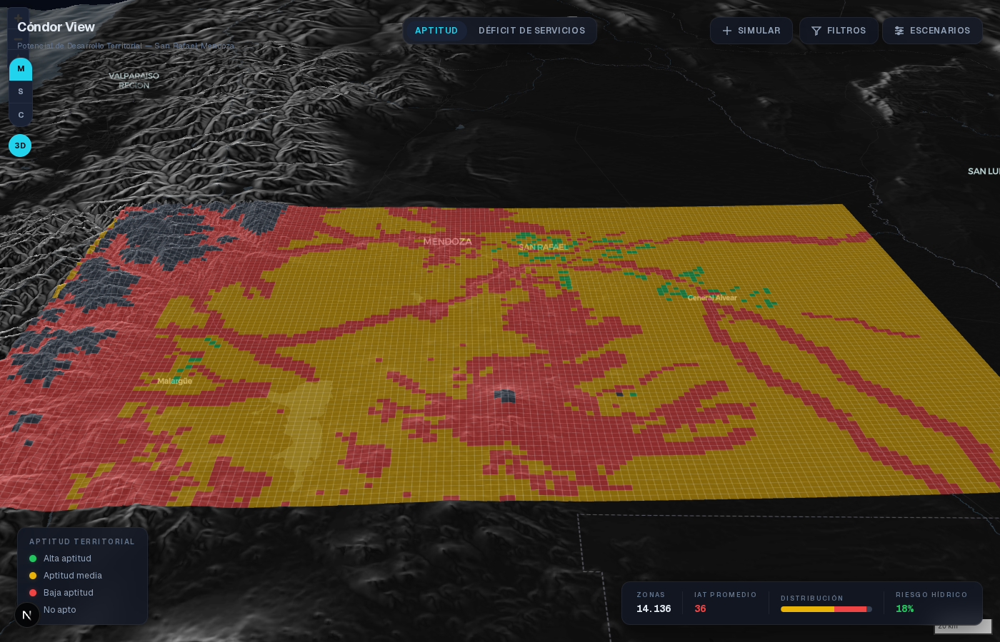
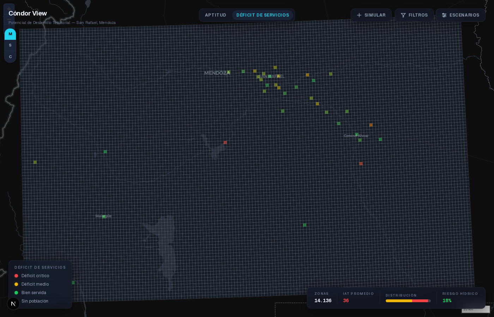
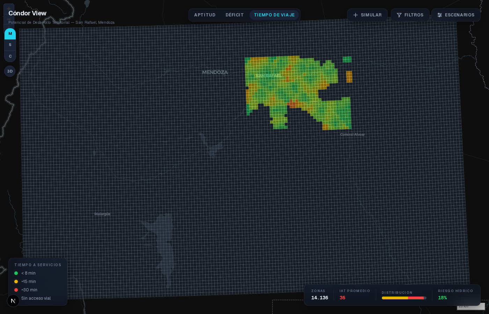
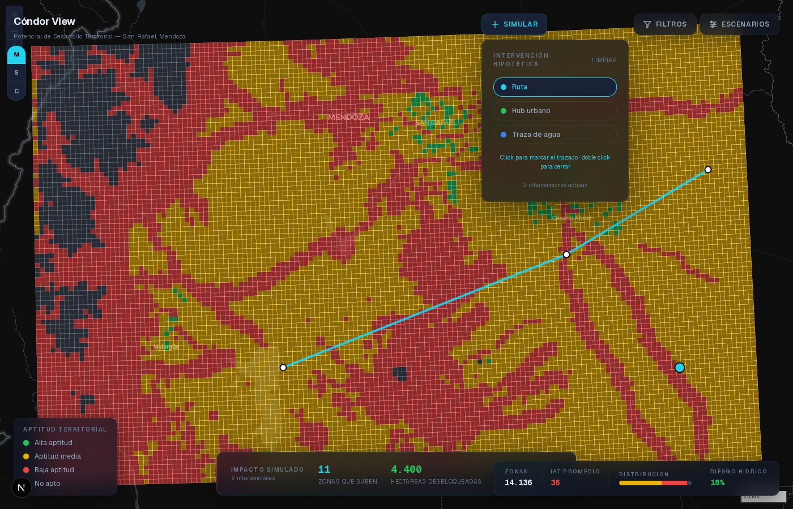

# Cóndor View — Inteligencia Territorial

Mapa web interactivo que puntúa el **potencial de desarrollo territorial** de un municipio y permite **simular intervenciones** para ver qué se desbloquea. Herramienta de decisión para gestión pública (intendentes), transparente y explicable — sin caja negra, sin machine learning.

**Piloto:** Departamento de San Rafael, Mendoza, Argentina (31.235 km², grilla de 2 km, ~14.136 zonas).



---

## Qué responde

| Pregunta del intendente | Cómo |
|-------------------------|------|
| ¿Dónde conviene desarrollar? | **Índice de Aptitud Territorial (IAT)** — normativa + físico + accesibilidad |
| ¿Dónde hay gente desatendida? | **Déficit de servicios** — población (censo) vs distancia a escuela/salud |
| ¿A cuántos minutos están los servicios? | **Isócronas reales** — tiempo de viaje sobre la red vial |
| ¿Qué pasa si construyo acá? | **Simulador de intervención** — coloca ruta/hub/agua → recalcula en vivo |
| ¿Qué obras hay/planeo? | **Registro de proyectos** sobre el mapa |

Cada puntaje es **auditable**: al clickear una zona se muestra el desglose de los sub-índices y las alertas que lo explican.

| Déficit de servicios | Isócronas | Simulador |
|---|---|---|
|  |  |  |

---

## Arquitectura

```
PIPELINE OFFLINE (Python, Docker)            FRONTEND (Next.js + MapLibre)
datos reales → scoring → zonas.geojson  →   carga GeoJSON → mapa interactivo
                                             (sin backend, hosting estático)
```

Sin base de datos ni API en runtime. El "modelo" es un GeoJSON precalculado. Las altas de proyectos del usuario persisten en `localStorage`.

---

## Datos (reales)

| Capa | Fuente |
|------|--------|
| Elevación / pendiente | DEM SRTM3 (90 m), reproyectado a EPSG:5343 |
| Red vial, ríos, uso del suelo, localidades, servicios | OpenStreetMap (osmnx) |
| Población | **INDEC Censo 2022** — radios censales (CONICET RI) |
| Isócronas | osmnx + networkx (red vial del oasis) |

CRS de cálculo: POSGAR 2007 faja 3 (EPSG:5343). Salida: WGS84 (EPSG:4326).

Pendiente (proxy actual): zonificación oficial (se usa OSM landuse) y catastro de parcelas (se usa grilla 2 km).

---

## Cómo correr

### Pipeline (genera `zonas.geojson`)

Requiere Docker.

```bash
cd pipeline
docker compose build
docker compose run --rm pipeline bash run_pipeline.sh
```

Corre los scripts numerados `00_descarga` → `08` → `06_export` (ver `run_pipeline.sh`). Cada script es idempotente. Parámetros (pesos, umbrales, geografía) en `pipeline/config.yaml`.

### Frontend

```bash
cd frontend
npm install
npm run dev      # http://localhost:3000
```

---

## Motor de scoring

```
IAT = 100 × (0.40·S_norm + 0.30·S_fis + 0.30·S_acc)
```

- **S_norm** (normativo): uso del suelo permitido.
- **S_fis** (físico): pendiente × riesgo hídrico × penalización por altitud.
- **S_acc** (accesibilidad): decaimiento exponencial por distancia a huella urbana, red vial y agua.
- Reglas duras: reservas y elevación > 3000 m → IAT = 0.

Pesos y umbrales son configurables en `config.yaml` — recalibrables con un urbanista sin tocar código. En el frontend, los pesos se ajustan en vivo (los sub-índices ya están guardados).

---

## Estructura

```
pipeline/   # Python + Docker — 00_descarga … 08, config.yaml
frontend/   # Next.js + MapLibre + Tailwind
spec/       # Especificación refinada (index, scoring, data, frontend, pipeline)
docs/       # Fuentes de datos, relevamiento de mercado, imágenes
```

---

## Estado

✅ Datos reales de punta a punta · 3 capas de análisis · simulador · 3D · registro de proyectos.
⏳ Validación de pesos con urbanista · zonificación/catastro oficial.

---

*Análisis multicriterio ponderado, explicable. Sin ML, sin backend.*
